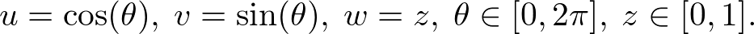
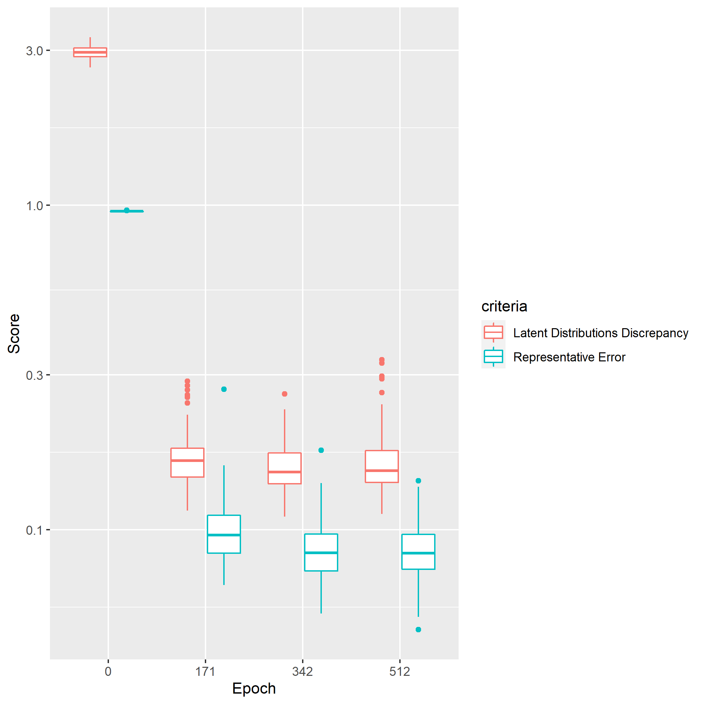
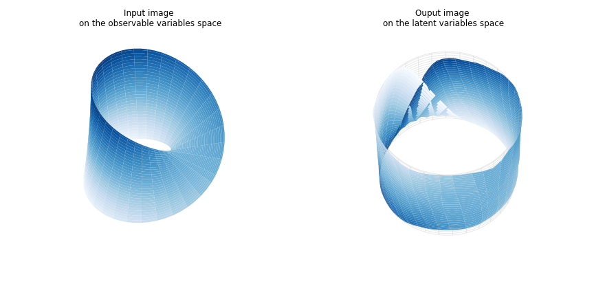
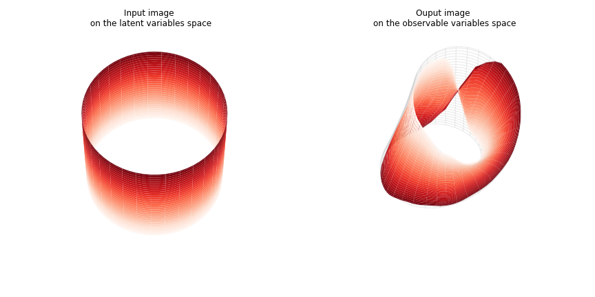
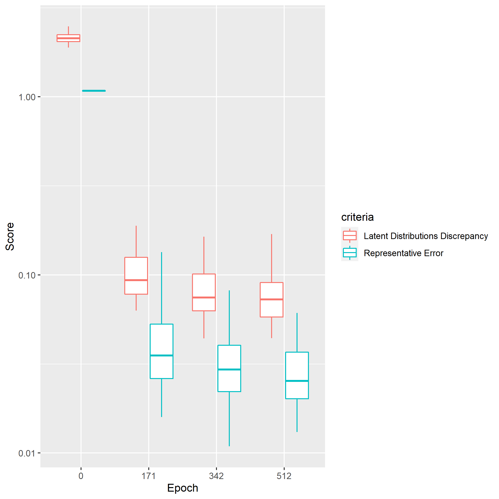
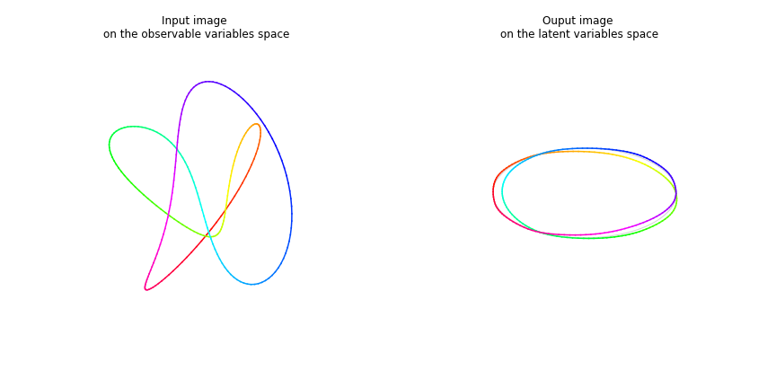
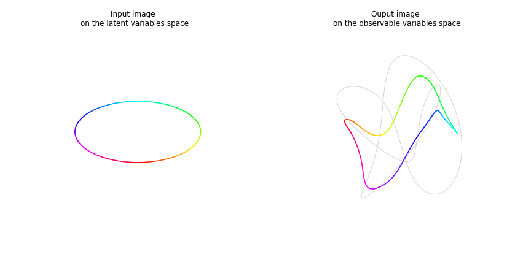

# 1. Introduction

Data scientists often choose the uniform distribution
or the normal distribution as the latent variable distribution
when they build representetive models of datasets.
For example,
the studies of the GANs [1] and the VAEs[2] used the uniformal random distribution and the normal one, respectively.

As the approximate function implimented by neural networks 
is usually continuous,
the topological structure of the latent variable distribution
is preserved after the transformation 
from the latent variable to the feature ones.
Given that the observed variables are distributed on a torus 
and that networks, for example the GANs, are trained with the latent variables
sampled from the normal distribution,
the structure of the distribution projected through the trained network
does not meet with the torus,
even though residual error is enough small.
Imagine another example
where the feature variables follow a mixtured distribution,
of whihch clusters separate each other,
trained variational auto encoder can encode the feature
on the latent variable with enough precision,
however,
the decoded distribution consists of 
a connected set 
since the latent variable is topologically equal with the ball.
This means that the topology of the given dataset is destroyed
through the projction of the trained networks.

In this short text,
we study the topological mismatch with the SAE[4],
which is enhanced based on the WAE[3] 
owing to the sinkhorn algorithm.

# 2. Specifications

## 2-1. Agent

Agents consists of encoder and decoder networks.
The encoder networks transform observable variables into latent variables,
and the decoder networks reverse the latent variables into the represented observable variables.

In our casestudies, we define these two networks as the multilayer perceptron
with the shared hyperparameters: number of units `nH`, number of layers `nLayer` and activation function.
The hyperparameters are defined in each case studies.

## 2-2. Environment

Environments generate datasets sampled from distributions of observable variables.
The distributions are defined in each case studies

## 2-3. Trainer

In all the case studies,
we adopt Sinkhorn AutoEncoder (SAE) objective[4]
as training criteria.
The regularization parameter is defined in each case studies.

# 3. Case studies

# 3-1. Case study #1:

This case study builds representitive models
of a two-dimensional 1-torus
by using the autoencoder with the latent variables
sampled from the two dimentional uniformal distribution.
We show an example of the consequence caused by the topological mismatch 
between the observable and the latent variables.

Models are trained by using the hyperparameters shown in the table 3.1.1.
The figure 3.1.1 (a) and (b) show the learning curves of the following 
training performances, respectively.
- Representative error, `mean((Y-Yhat)^2)`, where `Y and Yhat` are the original observed varibales and the represented ones, respectively.
- Discrepancy between the referenced distribution of the latent variables and the ones on which the observable variables distribution is projected through the trained encoder. Note that the discrepancy is measured by the absolute norm wasserstein distance.

The learning curves tell us that the training has converged at the end of the training iterations.

The figure 3.1.2(a) (or the figure 3.1.2(b)) shows the images projected through the encoder (or decoder) of the trained model which has the average performance among the trained models with `nLayer=7`.
The left one is the input image of the observed (or latent) variables approximated by an analytical function
and the right one is obtained by projecting the input image via the trained encoder(or decoder). 
Here are our findins.
- The learning curves in the figure 3.1.1(a) and (b) tell us that the projected samples can match well with the original samples and the distribution of the latent variables looks like the uniform distribution.
- The figure 3.1.2(a) shows that the hole mapped from the observable variables is fairly small and that the latent variables distribution is alomost covered by the projected one.
- Seeing the figure 3.1.2(b), the decoder's projected image is topologically identified with the disk, even though the region around the hole is stretched.

The last two findings say that the encoder and decoder as maps between the observable variables and the latent ones cannot preserve the topological structure.
This might cause practical problems. For example, 
if you optimize a function defined on a 1-torus
and if you plan to parameterize the decision variables on the torus by using the latent variables composed by autoencoder,
it might be possible that you find a solution at a point of the hole of the torus,
which is of course infeasible, 
because it exists a certain area in the latent variable which can be mapped on the hole of the torus.

Table 3.1.1. Hyper parameters 

|name|description|value|
|-|-|-|
|nEpoch|the number of epochs | 512|
|nBatch|the sample size of a single batch|512|
|nH|the number of units of the encoder and decoder network|512|
|nLayer|the number of layers of the encoder and decoder network| 3, 5 and 7|
|reg_param|the regularization parameter | 10 |

 
Fig 3.1.1(a) Learning curve of the representative error grouped by the number of layers in the network

 
Fig 3.1.1(b) Learning curve of the discrepancy between the the referenced and the projected  latent variablee distributions grouped by the number of layers in the network

 
Fig 3.1.2(a) Input and output image of a trained encoder

 
Fig 3.1.2(b) Input and output image of a trained decoder

# 3-2. Case study #2:

We move on the next case study to see another type of topological mismatch:
the one distributes on the twisted surface in the three dimensional space,
while the distribution of the other, not twisted.
It's impossible that the autoencoders consilliate this difference
since the twisted image (or not twisted) is mapped on to the twisted image (or not twisted).
We see the consequence of the wasserstein autoencoders' training subject to this toplogical mismatch.

Here is the specifications of our experiment.
The environment generates the dataset sampled randomly from the mobius band.
More precisely say that the the variables `x, y and z` in the three dimensional space randomly distribute on the surface difined in 
[site](https://en.wikipedia.org/wiki/M%C3%B6bius_strip#Geometry_and_topology)
.

On the other hand,
we define the agent that the distribution of the latent variables `u, v and w` follows
the uniformal random distribution over a ring as follow:

Note that the observable variables' distribution is twisted,
while the latent variables' one is not.

We train agents by using the hyperparameters in the table 3.2.1 and 
the figure 3.2.1 shows the learning curves of the pair of performances
mentioned already in the case study #1.
It tolds us that the training has converged at the end of the final epoch.
We see below in detail an agent among trained agents around the average performance.

The figure 3.2.2(a) shows how the trained encoder maps the observable variable image
(the blue in the left) to the latent variable image (the blue one in the right).
The projected image on the latent variable space represents well the referenced image(the gray one).
Particulaly, the part mapped from the twisted part of the input image 
is pushed and piled up on the surface of the referenced image 
due to the fact that the encoder cannot untangle the distortion of the mobius band.

The figure 3.2.2(b) shows the referenced latent variable image(the red one in the left) 
and its projected image on the observable variable space
by the trained decoder (the red one in the right).
As mentioned in the case of the encoder, the projected image looks like the referenced observable image(the gray one in the right),
though, since the refrenced latent image is not twisted, a part of projected image is streched and flipped to 
the twisted part of the mobius band.
This happens because the decoder has to preserve the topological structure.

Thus, however well wasserstein autoencoders can regenerate datasets of distributions with complex structures
in the data-driven manner, they cannot represent topological structure.

Table 3.2.1. Hyper parameters 

|name|description|value|
|-|-|-|
|nEpoch|the number of epochs | 512|
|nBatch|the sample size of a single batch|512|
|nH|the number of units of the encoder and decoder network|128|
|nLayer|the number of layers of the encoder and decoder network|3|
|reg_param|the regularization parameter | 10 |

 
Fig 3.2.1 Learning curve of the representative error and the discrepancy between the the referenced and the projected  latent variable distributions

 
Fig 3.2.2(a) Input and output image of a trained encoder

 
Fig 3.2.2(b) Input and output image of a trained decoder

# 3-3. Case study #3:

In the third example, 
we take account of the difference of knots as an example of topological mismatch.
We try to represent a shape of one type of knot by transforming another shape of the other type of knot
and we see what happens to the autoencoders' training due to this discrepancy.

Here is the configuration of agents and environments:
- The environment randomly samples values from [a trefoil knot](https://en.wikipedia.org/wiki/Trefoil_knot#Descriptions) in three-dimensional space.
- The latent variable of the agents are sampled from an unknot circle in three-dimensional space.

The table 3.3.1 shows the hyperparameter set for the training.
Note that small batch size: `nBatch` is required in this training
probably because small sized batch can break better the symmetry accross the x-y plane of the observable variables distribution.
The training has already saturated at the end of epochs, which is confirmed in the learning curves on the figure 3.3.1.

We analyze a trained agent with the average performance.
The figure 3.3.2(a) shows the transformation of the trained encoder from the observable variables distribution
to the latent variables one.
Although the output image is close to the referenced latent variables distribution
, the output image seemingly preserves the knots of the original image.
The figure 3.3.2(b) shows the referenced latent variables image, namely the simple circle,
and its projected image by the trained decoder on the observable variables space.
The output closed loop is approaching to the original trefoil knot,
however, it's hard to fit because the projected image cannot make knots in their own.

In this way, even if the numerical evaluations of the error and the discrepancy of distributions are small,
the wasserstein autoencoders are not capable to create new knots.
The topological discrepancy cannot be resolved just by the autoencoders.

Table 3.3.1. Hyper parameters 

|name|description|value|
|-|-|-|
|nEpoch|the number of epochs | 512|
|nBatch|the sample size of a single batch|32|
|nH|the number of units of the encoder and decoder network|32|
|nLayer|the number of layers of the encoder and decoder network|3|
|reg_param|the regularization parameter | 0.1 |
|activation|activation function of agent|tanh|

 
Fig 3.3.1 Learning curve of the representative error and the discrepancy between the the referenced and the projected  latent variable distributions

 
Fig 3.3.2(a) Input and output image of a trained encoder

 
Fig 3.3.2(b) Input and output image of a trained decoder

# 4. References

<ul>
<li>[1]:
Ian J. Goodfellow, Jean Pouget-Abadie, Mehdi Mirza, Bing Xu, David Warde-Farley, Sherjil Ozair, Aaron Courville, Yoshua Bengio: “Generative Adversarial Networks”, 2014; <a href='http://arxiv.org/abs/1406.2661'>arXiv:1406.2661</a>.
</li>
<li>[2]:
Diederik P Kingma, Max Welling: “Auto-Encoding Variational Bayes”, 2013; <a href='http://arxiv.org/abs/1312.6114'>arXiv:1312.6114</a>.
</li>
<li>[3]:
Ilya Tolstikhin, Olivier Bousquet, Sylvain Gelly, Bernhard Schoelkopf: “Wasserstein Auto-Encoders”, 2017; <a href='http://arxiv.org/abs/1711.01558'>arXiv:1711.01558</a>.
</li>
<li>[4]:
Giorgio Patrini, Rianne van den Berg, Patrick Forré, Marcello Carioni, Samarth Bhargav, Max Welling, Tim Genewein, Frank Nielsen: “Sinkhorn AutoEncoders”, 2018; <a href='http://arxiv.org/abs/1810.01118'>arXiv:1810.01118</a>.
</li>
</ul>
