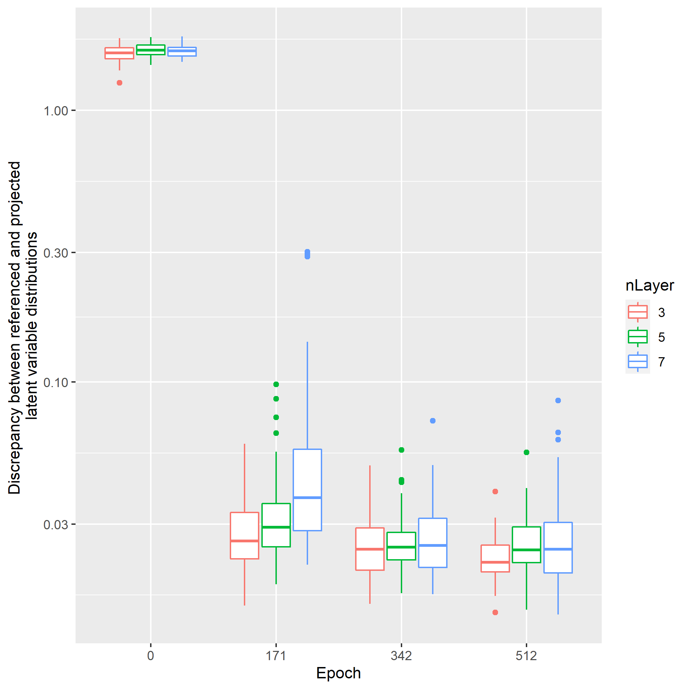

# 1. Introduction

Data scientists often choose the uniform distribution
or the normal distribution as the latent variable distribution
when they build representetive models of datasets.
For example,
the studies of the GANs [1] and the VAEs[2] used the normal distribution.

As the approximate function implimented by neural networks 
is usually continuous,
the topological structure of the latent variable distribution
is preserved after the transformation 
from the latent variable to the feature ones.
Given that the observed variables are distributed on a torus 
and that networks, for example the GANs, are trained with the latent variables
sampled from the normal distribution,
the structure of the distribution projected through the trained network
does not meet with the torus,
even though residual error is enough small.
Imagine another example
where the feature variables follow a mixtured distribution,
of whihch clusters separate each other,
trained variational auto encoder can encode the feature
on the latent variable with enough precision,
however,
the decoded distribution consists of 
a connected set 
since the latent variable is topologically equal with the ball.
This means that the topology of the given dataset is destroyed
through the projction of the trained networks.

In this short text,
we study the topological mismatch with the SAE[3],
which is enhanced based on the WAE[4] 
owing to the sinkhorn algorithm.

# 2. Specifications

# 3. Case studies

# 3-1. Case study #1:

This case study builds representitive models
of a two-dimensional 1-torus
by using the autoencoder with the latent variables
sampled from the two dimentional uniformal distribution.
We show an example of the consequence caused by the topological mismatch 
between the observable and the latent variables.

Models are trained by using the hyperparameters shown in the table 3.1.1.
The figure 3.1.1 (a) and (b) show the learning curves of the following 
training performances, respectively.
- Representative error, `mean((Y-Yhat)^2)`, where `Y and Yhat` are the original observed varibales and the represented ones, respectively.
- Discrepancy between the referenced distribution of the latent variables and the ones on which the observable variables distribution is projected through the trained encoder. Note that the discrepancy is measured by the absolute norm wasserstein distance.

The learning curves tell us that the training has converged at the end of the training iterations.

The figure 3.1.2(a) (or the figure 3.1.2(b)) shows the images projected through the encoder (or decoder) of the trained model which has the average performance among the trained models with `nLayer=7`.
The left one is the input image of the observed (or latent) variables approximated by an analytical function
and the right one is obtained by projecting the input image via the trained encoder(or decoder). 
Here are our findins.
- The learning curves in the figure 3.1.1(a) and (b) tell us that the projected samples can match well with the original samples and the distribution of the latent variables looks like the uniform distribution.
- The figure 3.1.2(a) shows that the hole mapped from the observable variables is fairly small and that the latent variables distribution is alomost covered by the projected one.
- Seeing the figure 3.1.2(b), the decoder's projected image is topologically identified with the disk, even though the region around the hole is stretched.

The last two findings say that the encoder and decoder as maps between the observable variables and the latent ones cannot preserve the topological structure.
This might cause practical problems. For example, 
if you optimize a function defined on a 1-torus
and if you plan to parameterize the decision variables on the torus by using the latent variables composed by autoencoder,
it might be possible that you find a solution at a point of the hole of the torus,
which is of course infeasible, 
because it exists a certain area in the latent variable which can be mapped on the hole of the torus.

Table 3.1.1. Hyper parameters 

|name|description|value|
|-|-|-|
|nEpoch|the number of epochs | 512|
|nBatch|the sample size of a single batch|512|
|nH|the number of units of the encoder and decoder network|512|
|nLayer|the number of layers of the encoder and decoder network| 3, 5 and 7|
|reg_param|the regularization parameter | 10 |

 
Fig 3.1.1(a) Learning curve of the representative error grouped by the number of layers in the network

 
Fig 3.1.1(b) Learning curve of the discrepancy between the the referenced and the projected  latent variablee distributions grouped by the number of layers in the network

 
Fig 3.1.2(a) Input and output image of a trained encoder

 
Fig 3.1.2(b) Input and output image of a trained decoder

# 3-2. Case study #2:

We move on the next case study to see another type of topological mismatch:
the one distributes on the twisted surface in the three dimensional space,
while the distribution of the other, not twisted.
It's impossible that the autoencoders consilliate this difference
since the twisted image (or not twisted) is mapped on to the twisted image (or not twisted).
Wee se the consequence of the wasserstein autoencoders' training subject to this toplogical mismatch.

Here is the specifications of our experiment.
The environment generates the dataset sampled randomly from the mobius band.
More precisely say that the the variables `x, y and z` in the three dimensional space distribute as follow:

On the other hand,
we define the agent that the distribution of the latent variables `u, v and w` follows
the uniformal random distribution over a ring as follow:

Note that the observable variables' distribution is twisted,
while the latent variables' one is not.
